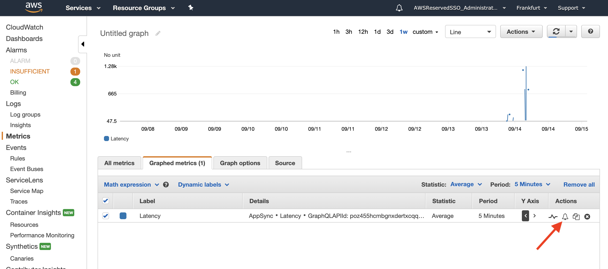
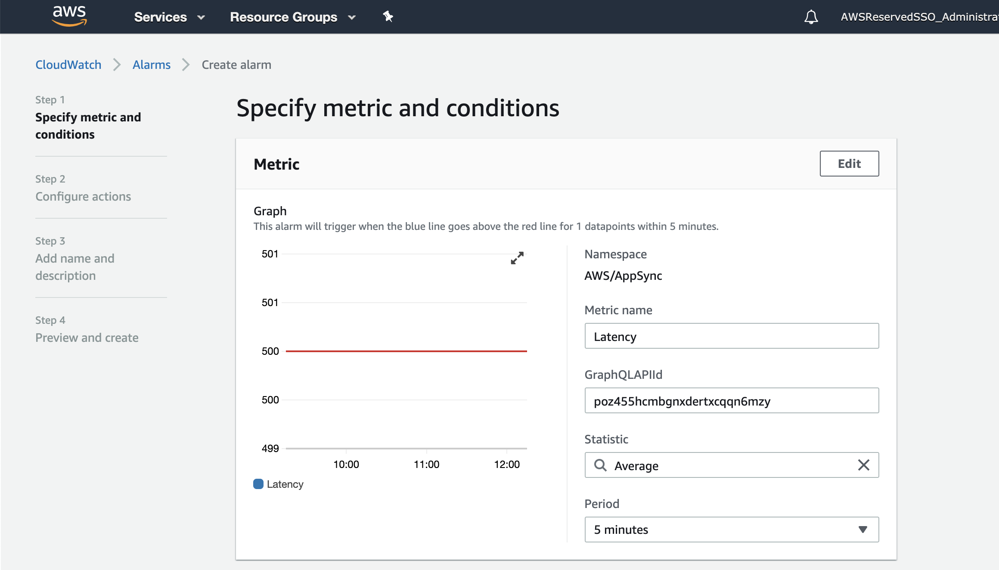
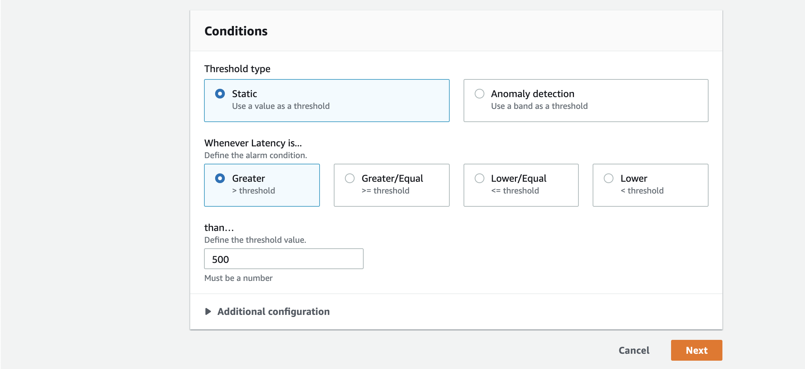
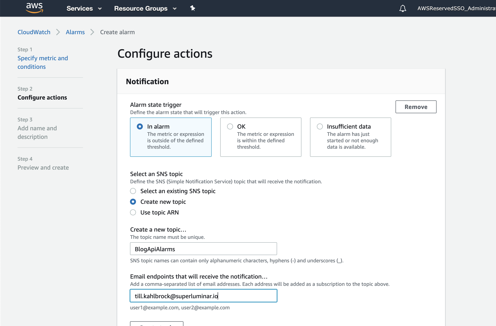
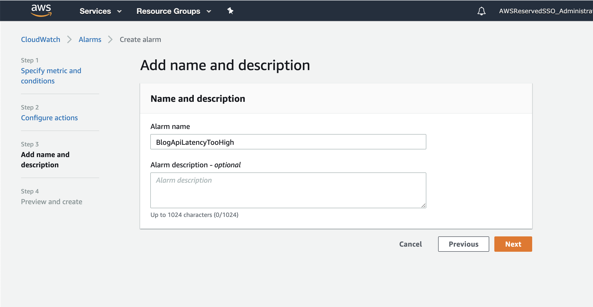
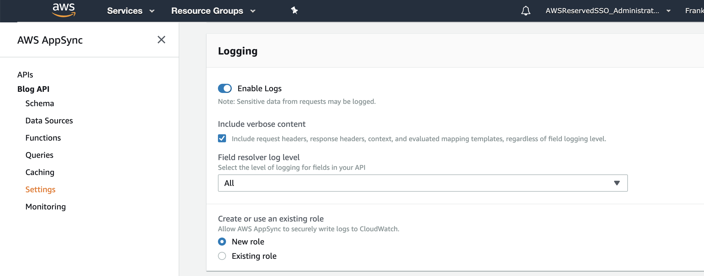
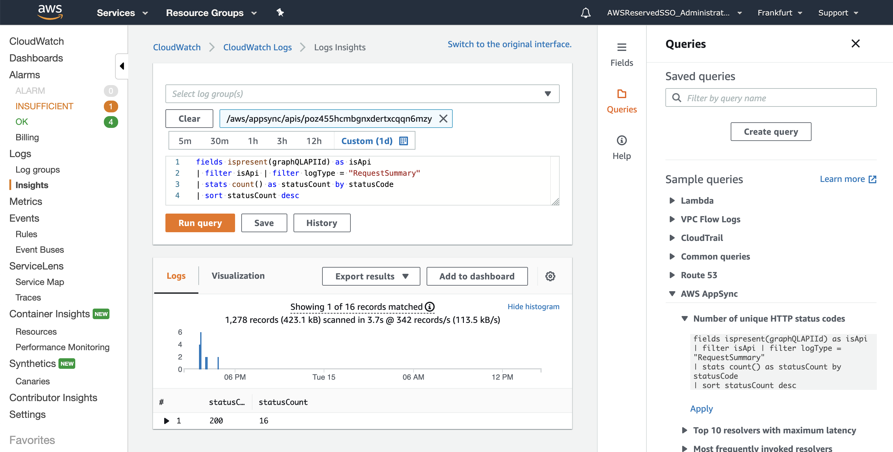

# Lab 3 - Monitoring / Logging

## In this lab …

* Check out basic metrics provided by AWS
* Create Alarms based on these metrics
* Activate Logging for your AppSync API

## Monitoring + Alerting

When using serverless components from AWS you leave big part of the heavy lifting to Amazon. 
This gives you the freedom of not having to worry about monitoring any servers anymore. 

Nonetheless, there are still things that could go wrong:

- You can deploy code that only errors under certain circumstances, not covered by your integration tests.
- You can hit the memory limit of your function.
- Your function can get throttled, because there is not enough reserved concurrency left.

## What to monitor?

Most AWS services generates some useful metrics on their own. AppSync is a bit restrained in this regard, but let's take a look:

1. Go to the [Cloudwatch console](https://console.aws.amazon.com/cloudwatch)
1. Navigate to **Metrics**
1. Select **AppSync** in the list of metrics and filter for **API Metrics**
1. Here we can see a list of all available metrics for all our APIs
(check out [the docs](https://docs.aws.amazon.com/appsync/latest/devguide/monitoring.html) for details)


Now we are going to create an alarm. It should be triggered if the latency of our API gets bad.

1. Select the **Latency** metric
1. Click on the **Graphed metrics** tab
1. Find the little bell icon 🔔 on right side and click it to create an alarm for this metric

1. Use the **Average** statistic and set the **Period** to 5 minutes
1. Configure your alarm to get triggered when the latency is above 500ms
1. Click on **Next**

 
1. Configure an SNS Topic to receive email notifications for the alarm
You will receive a confirmation email. Do not forget to click the link!
1. If you need to create a new topic, hit the **Create topic** button
1. Click on **Next**

1. Name the alarm and click on **Create alarm**


You can now:

- introduce latency into your pipeline. For instance, you could let the **hasBadEmojis** function sleep for 500ms:
    ```javascript
    exports.handler = async ({ content }) => {
        const badEmojis = ['🖕', '💩'];

        await sleep(500);
        let hasBadEmojis = false;
        badEmojis.forEach(badEmoji => {
            if (content.indexOf(badEmoji) !== -1) {
                hasBadEmojis = true;
            }
        })
        return { hasBadEmojis }
    };

    function sleep(ms) {
      return new Promise((resolve) => {
        setTimeout(resolve, ms);
      });
    }
    ```
- create a comment
- see, if the alarm goes off

## Notifications

We created an SNS topic earlier to receive notification for our latency alarm. 
Let's have a look, what was created in background.

1. Go to the [SNS console](https://console.aws.amazon.com/sns/)
1. Find the topic you create earlier and click on the name
1. Go to subscription and check the subscription status for your email address

## Activate Logging

Logging for your API is disable by default. To enable it, do the following:

1. Go back to the [AppSync console](console.aws.amazon.com/appsync) and select the API.
1. Choose **Settings** from the navigation panel.
1. Under **Logging**, click the toggle to Enable Logs.
1. When the console prompts you, provide or create a CloudWatch ARN role.
1. Enable **Include verbose content** to activate [Request Level Logs](https://docs.aws.amazon.com/appsync/latest/devguide/monitoring.html#cwl).
1. Set the **Field resolver log level** to **All**.
1. **Save** your changes.


Now we need to make some queries, in order get log output. After that, we hopefully find some logs in CloudWatch Logs.

## Cloudwatch Logs Insights

Cloudwatch Logs Insights has some neat examples for querying interesting data about your API and resolvers:

1. Goto [CloudWatch Logs Insights console](https://eu-central-1.console.aws.amazon.com/cloudwatch/home?region=eu-central-1#logsV2:logs-insights).
1. Click on **Queries** on the left side.
1. Open the **AWS AppSync** sample queries and execute them. 

